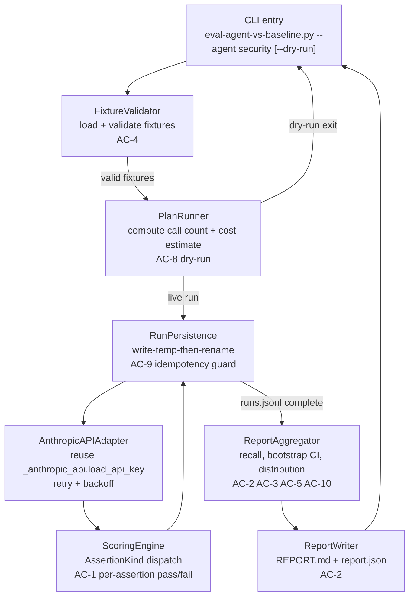

# DESIGN-004: Agent Eval Harness Spike

## Requirements Addressed

- REQ-004 Cluster A ([#req-cluster-a]): Spike runner — record, reproduce, report (AC-1, AC-2, AC-3, AC-7, AC-8, AC-9, AC-10)
- REQ-004 Cluster B ([#req-cluster-b]): Fixture validation (AC-4)
- REQ-004 Cluster C ([#req-cluster-c]): Decision-anchored report (AC-5)
- REQ-004 Cluster D ([#req-cluster-d]): ADR methodology documentation (AC-6)

## Design Overview

A new sibling runner `scripts/eval/eval-agent-vs-baseline.py` executes a held-out fixture corpus against two prompt variants (agent vs. baseline) at temperature=0 across N=3 run indices. It reuses the existing `_anthropic_api` and `_eval_common` modules. Eight components compose the runner: CLI entry, `FixtureValidator`, `PlanRunner` (cost + plan), `ScoringEngine` (Strategy over `AssertionKind`), `RunPersistence` (idempotency + atomic writes), `AnthropicAPIAdapter` (retry + log), `ReportAggregator` (recall + bootstrap CI + flakiness), and `ReportWriter`. Assertions dispatch polymorphically through `ScoringEngine` keyed on `AssertionKind`. Results land in a versioned directory tree under `evals/security-spike/`.

This design does NOT extend `eval-prompt-change.py` (ADR-057: before/after) or `eval-agents.py` (LLM-as-judge quality assessor). It answers a different question: does the agent prompt outperform a generic prompt on the same model?

## Data Flow



## Component Architecture

### 5.1 CLI Entry Point — `eval-agent-vs-baseline.py`

**Purpose**: Parse arguments, coordinate components, exit with typed codes.

**Responsibilities**:
- Accept `--agent <name>`, `--fixtures <path>`, `--n-runs <int>`, `--dry-run`, `--run-id <str>`
- Delegate to `FixtureValidator`, `PlanRunner`, `RunPersistence`, `ReportAggregator`
- Exit 0 = success, 1 = logic/flakiness/duplicate, 2 = config/fixture invalid, 3 = external/API persistent failure

**Interface**: `main(argv: list[str]) -> int`

---

### 5.2 FixtureValidator

**Purpose**: Load and validate the corpus before any API call. Implements AC-4.

**Responsibilities**:
- Parse each `.json` file in the fixtures directory
- Check required fields: `id`, `input`, `provenance`, `assertions[]`
- Reject `provenance` values outside `{synthetic, public-cve, paraphrased-from-public}`
- Enforce `schemaVersion: 1` presence (AC-7); reject any other value
- Validate `tags`: must be a `list[str]` if present (default `[]`); each tag matches `^[a-z0-9][a-z0-9_:-]{0,63}$` (lowercase, ≤64 chars, restricted charset). Reject otherwise. Tags are advisory metadata for filtering reports; they do not gate anything.

**Interface**:
```python
@dataclass
class Fixture:
    id: str
    input: str
    provenance: Literal["synthetic", "public-cve", "paraphrased-from-public"]
    assertions: list[Assertion]
    tags: list[str]
    schema_version: int  # must equal 1

def validate_fixtures(paths: list[Path]) -> list[Fixture]: ...
# raises FixtureValidationError on first invalid fixture
```

---

### 5.3 Assertion Interface and ScoringEngine (Strategy over AssertionKind)

**Purpose**: Polymorphic dispatch per assertion type. This is the highest-risk abstraction in the CVA. Ship interface + two concrete kinds (regex, verdict) in the spike; defer AST and test-pass.

**`AssertionKind` enum**:
```python
class AssertionKind(str, Enum):
    REGEX = "regex"
    VERDICT = "verdict"
    # AST = "ast"        # deferred
    # TEST_PASS = "test_pass"  # deferred
```

**`Assertion` dataclass**:
```python
@dataclass
class Assertion:
    kind: AssertionKind
    pattern: str | None = None    # regex pattern (for REGEX kind)
    expected_value: str | None = None  # expected verdict string (for VERDICT kind)
    # Future kinds (AST, TEST_PASS) add fields as Optional with default None.
    # This avoids a single 'value' field whose semantics depend on 'kind' at runtime,
    # which the CVA review flagged as a future breaking-change risk.
```

**`AssertionResult` dataclass**:
```python
@dataclass
class AssertionResult:
    kind: AssertionKind
    value: str
    passed: bool
    extracted: str | None  # what the scorer extracted from the response
```

**`ScoringEngine`**:
```python
class ScoringEngine:
    _scorers: dict[AssertionKind, Callable[[Assertion, str], AssertionResult]]

    def register(self, kind: AssertionKind, scorer: Callable) -> None: ...
    def score(self, assertion: Assertion, response: str) -> AssertionResult: ...
    def score_all(self, assertions: list[Assertion], response: str) -> list[AssertionResult]: ...
```

**Concrete scorers** (registered at startup, not embedded in engine):

- `RegexScorer`: `re.search(assertion.value, response, re.IGNORECASE)` — passed if match found
- `VerdictScorer`: extracts first token from response matching `IDENTIFY|OK|ESCALATE`; passed if it equals `assertion.value` (case-insensitive)

**Rationale**: Strategy pattern means adding `AstScorer` later requires zero edits to `ScoringEngine` or `Fixture` schema. The CVA identifies assertion interface as the greatest abstraction risk; making it explicit and polymorphic now prevents a rewrite when the second kind arrives.

---

### 5.3a PlanRunner

**Purpose**: Compute the planned execution scope and cost estimate before any API call. Implements the dry-run path of AC-8.

**Responsibilities**:
- Given validated fixtures, model id, variant count (always 2), and `n_runs`, compute total planned API call count: `len(fixtures) × 2 × n_runs`.
- Estimate token cost: `(planned_calls × EST_TOKENS_PER_CALL) × published_rate(model_id, as_of=<date>)`. Reuse `EST_TOKENS_PER_CALL` from `_eval_common`. Pricing rate constant lives in `_eval_common.MODEL_PRICING_RATES_USD_PER_1K_TOKENS` (created in T4-2; see Tech Decisions).
- On `--dry-run`: print plan + cost to stdout, exit 0; never instantiate `AnthropicAPIAdapter`.
- On normal run: hand off to `RunPersistence` + `AnthropicAPIAdapter` with the same plan object so the runner uses the same numbers it printed.

**Interface**:
```python
@dataclass
class ExecutionPlan:
    fixtures: list[Fixture]
    variants: list[Literal["agent", "baseline"]]
    n_runs: int
    model_id: str
    planned_calls: int
    estimated_tokens_in: int
    estimated_tokens_out: int
    estimated_cost_usd: float
    pricing_rate_as_of: str  # ISO date the rate constant was last updated

def build_plan(
    fixtures: list[Fixture],
    model_id: str,
    n_runs: int = 3,
) -> ExecutionPlan: ...
```

**Why a separate component**: keeps cost estimation testable without mocking the API adapter, and makes the dry-run / live-run paths share one source of truth.

---

### 5.4 AnthropicAPIAdapter

**Purpose**: Thin adapter over `scripts/eval/_anthropic_api.py`. Enforces timeout, retry policy, and idempotency key. Implements Release It! circuit-breaker principle at the integration point.

**Responsibilities**:
- Reuse `load_api_key()` from `_anthropic_api`
- Always set `temperature=0`
- Retry on 429 / 408 / 5xx / timeout: max 3 attempts, exponential backoff with jitter (base=1s, max=30s)
- Record `outcome=error` immediately on non-transient 4xx (other than 408 and 429, which are transient)
- Log structured JSON to stderr: `fixture_id`, `variant`, `model_id`, `attempt`, `outcome`, `latency_ms`, `tokens_in`, `tokens_out`, `error_category`
- Never log request bodies, API keys, or raw error payloads

**Interface**:
```python
@dataclass
class APICallResult:
    outcome: Literal["success", "error"]
    raw_response: str | None
    tokens_in: int
    tokens_out: int
    latency_ms: float
    error_category: str | None  # e.g. "rate_limit", "server_error", "timeout"
    attempts: int

def call_model(
    prompt: str,
    model_id: str,
    fixture_id: str,
    variant: str,
    run_index: int,
    *,
    max_retries: int = 3,
) -> APICallResult: ...
```

---

### 5.5 RunPersistence

**Purpose**: Write run records to disk with idempotency guard. Implements AC-9 and the write-temp-then-rename pattern.

**Responsibilities**:
- Compute run directory: `evals/security-spike/runs/<RUN_ID>/` (`RUN_ID` = ISO8601 timestamp + UUID4)
- Load existing records from `runs.jsonl` at start to build seen-key set
- Guard: before each write, check `(fixture_id, variant, run_index)` not in seen set; raise `DuplicateRunError` if present
- Write to temp file, rename atomically
- Append record to `runs.jsonl`

**`RunRecord` schema (schemaVersion: 1)**:
```json
{
  "schemaVersion": 1,
  "fixture_id": "F001",
  "variant": "agent",
  "run_index": 0,
  "model_id": "claude-sonnet-4-6",
  "prompt_sha": "<sha256 of prompt text, UTF-8, no trailing newline>",
  "prompt_ref": "<path relative to repo root, e.g. templates/agents/security.shared.md>",
  "fixture_sha": "<sha256 of fixture JSON file content, UTF-8>",
  "raw_response": "...",
  "assertions": [
    {"kind": "verdict", "value": "IDENTIFY", "passed": true, "extracted": "IDENTIFY"}
  ],
  "outcome": "success",
  "latency_ms": 1234.5,
  "tokens_in": 512,
  "tokens_out": 80,
  "error_category": null,
  "attempts": 1
}
```

---

### 5.6 ReportAggregator

**Purpose**: Compute recall, bootstrap CI, flakiness. Implements AC-2, AC-3, AC-5, AC-10.

**Responsibilities**:
- Compute aggregations directly. **Do not reuse** `_eval_common.aggregate_multi_run_scores` — its signature is `(run_scores: list[dict[str, Any]], dimensions: list[str])` averaging LLM-as-judge dimensional scores, which does not match the binary pass/fail recall model used here. A new module-private helper is added inside `_report_aggregator.py` instead.
- Recall denominator = total assertion count across all fixtures (not just passed fixtures)
- `recall_with_errors`: errors count as failed assertions
- `recall_excluding_errors`: errors excluded from denominator
- Per-fixture pass-rate distribution across N=3 runs
- Paired-bootstrap CI (n=10000 resamples, 95% CI) on signed recall delta (agent minus baseline)
- Flakiness flag: per-fixture pass-rate variance > 0 across identical SHA runs (AC-10)
- Total tokens, wall-clock, cost estimate (tokens × published rate for model)

**`Report` schema (schemaVersion: 1)**:
```json
{
  "schemaVersion": 1,
  "run_id": "...",
  "model_id": "claude-sonnet-4-6",
  "agent_prompt_sha": "...",
  "baseline_prompt_sha": "...",
  "fixture_set_sha": "<sha256 of sorted(filename + ':' + file_sha for each .json in fixtures/), joined by newline, UTF-8>",
  "agent_recall": 0.82,
  "baseline_recall": 0.60,
  "recall_delta": 0.22,
  "bootstrap_ci_95": [0.10, 0.34],
  "recall_with_errors": 0.80,
  "recall_excluding_errors": 0.82,
  "per_fixture_pass_rates": {
    "F001": {"agent": [1.0, 1.0, 1.0], "baseline": [0.5, 0.5, 0.5]}
  },
  "flakiness": false,
  "total_tokens_in": 15360,
  "total_tokens_out": 2400,
  "wall_clock_seconds": 187,
  "cost_estimate_usd": 0.09,
  "recommendation": "graduate-to-CI",
  "error_count": 0
}
```

---

### 5.7 ReportWriter

**Purpose**: Render `REPORT.md` and `report.json` at `evals/security-spike/reports/<RUN_ID>/`.

**Responsibilities**:
- Write `report.json` (write-temp-then-rename)
- Render `REPORT.md` from report data with sections: summary table, per-fixture breakdown, CI visualization, recommendation with evidence, cost summary
- Include signed delta and CI in the summary table

---

## Persistence Layout

```
evals/
  security-spike/
    fixtures/
      F001.json       # Fixture, schemaVersion: 1
      F002.json
      ...
    runs/
      <RUN_ID>/       # e.g. 20260503T140000Z-<uuid4>
        runs.jsonl    # one RunRecord JSON per line, schemaVersion: 1 on each
    reports/
      <RUN_ID>/
        report.json   # Report, schemaVersion: 1
        REPORT.md     # Human-readable
  README.md           # cross-references tests/evals/ (ADR-057)
```

`RUN_ID` = `<ISO8601-compact>-<uuid4>` — no collisions by construction.

---

## Technology Decisions

| Decision | Choice | Rationale |
|---|---|---|
| Assertion dispatch | Strategy pattern over `AssertionKind` enum | CVA identifies assertion interface as greatest abstraction risk; polymorphism protects against premature lock-in |
| Scoring signal | Deterministic only (regex + verdict) | LLM-as-judge rejected as gated signal per PRD; deterministic = reproducible |
| Temperature | 0 on all calls | Eliminates stochastic variance; N=3 runs test only prompt sensitivity |
| API client | Reuse `_anthropic_api` | DRY; existing retry + key loading already validated |
| Bootstrap CI | Paired bootstrap (n=10000) | More appropriate than t-test for discrete recall metric; no normality assumption |
| Persistence | Write-temp-then-rename | Atomic; prevents partial writes in `runs.jsonl` |
| Run directory | Timestamped + UUID | Collision-free; no shared state |
| Schema | `schemaVersion: 1` on all records | Two-step migration path for future evolution |
| Baseline prompt | `"Review the following input. Respond with one word: IDENTIFY, OK, or ESCALATE. Then explain in <=80 words."` | **Deliberately naive**: no domain vocabulary ("security", "CWE", "vulnerability", "threat"), no role assignment. Same response shape as agent so scoring is symmetric. Any lift the agent shows is attributable to the system prompt's specialization, not to the task framing. SHA = SHA-256(UTF-8, no trailing newline). |
| Model | `claude-sonnet-4-6` | Single-model spike per OQ-4; matrix deferred |
| Log target | stderr (structured JSON) | stdout reserved for user-facing output; stderr for observability |
| Prior art reuse | `_anthropic_api`, `_eval_common` | Existing modules already validated; DRY |

---

## Cross-References to Existing Modules

| Module | Relationship |
|---|---|
| `scripts/eval/_anthropic_api.py` | REUSE: `load_api_key()`, retry constants |
| `scripts/eval/_eval_common.py` | REUSE: `EST_TOKENS_PER_CALL`, `aggregate_multi_run_scores` |
| `scripts/eval/eval-prompt-change.py` | SIBLING: ADR-057 before/after; do not extend |
| `scripts/eval/eval-agents.py` | DIFFERENT QUESTION: LLM-as-judge agent quality; do not extend |
| `tests/evals/security-scenarios.json` | BOOTSTRAP: consider as corpus seed; mark `provenance: paraphrased-from-public` |
| `.agents/architecture/ADR-057-prompt-behavioral-evaluation.md` | CROSS-REF: different question; cite in ADR-NNN |
| `.claude/rules/security.md` | CONSTRAINT: API key handling, no secrets in logs |
| `.agents/governance/SECURITY-REVIEW-PROTOCOL.md` | CONSTRAINT: security review gate |

---

## Security Considerations

- `ANTHROPIC_API_KEY` sourced from env only; never logged, never stored in run records
- Response bodies stored in `runs.jsonl` on disk; redacted from stderr structured logs
- Fixtures must declare `provenance`; real credentials rejected at ingest (AC-4)
- Token counts logged; cost-estimate in report (observability, not enforcement)
- Spike modifies no security gates
- Cite `.claude/rules/security.md` and `.agents/governance/SECURITY-REVIEW-PROTOCOL.md` in implementation

---

## Failure Modes

| Failure | Handling |
|---|---|
| Transient API error (408, 429, 5xx, timeout) | Retry max 3, exponential backoff + jitter (base=1s, max=30s); record `outcome=error` after max retries |
| Non-transient 4xx (any 4xx other than 408 and 429) | Record `outcome=error` immediately; no retry |
| Error rate > 10% of fixtures | Fail spike; exit code 1; structured message |
| Duplicate `(fixture_id, variant, run_index)` | Raise `DuplicateRunError`; exit code 1 |
| Unknown `schemaVersion` | Raise `SchemaVersionError`; exit code 2 |
| Missing required fixture field | Raise `FixtureValidationError`; exit code 2 |
| Flakiness detected (any fixture has pass-rate variance > 0 across N runs on same SHA) | Set `flakiness=true` in `report.json`; print structured warning; exit code 1 |

All failure exit codes follow AGENTS.md: 0=ok, 1=logic, 2=config, 3=external, 4=auth.

---

## Testing Strategy

| Layer | Coverage target | Notes |
|---|---|---|
| `FixtureValidator` | 100% | Security-adjacent; covers all provenance rejection paths |
| `ScoringEngine` + scorers | 100% | Each `AssertionKind` positive + negative + edge (empty response, partial match) |
| `RunPersistence` duplicate guard | 100% | Mock filesystem; test atomic rename |
| `AnthropicAPIAdapter` | 80% | Mock API; test retry, backoff, error categories |
| `ReportAggregator` | 80% | Test recall formula, bootstrap bounds, flakiness flag |
| CLI integration | 60% | Happy path, dry-run, fixture-invalid exit |

Tests live under `tests/evals/test_eval_agent_vs_baseline.py`. Use `pytest 8+`. Mock API calls at the adapter boundary; never hit the real API in unit tests.

---

## Open Questions

All confirmed by default per issue PRD (OQ-1 through OQ-7):

- OQ-1: Spike agent = `security`
- OQ-2: `evals/security-spike/` directory layout
- OQ-3: Held-out = paraphrased-from-public + synthetic
- OQ-4: Single model = `claude-sonnet-4-6`
- OQ-5: Baseline prompt text as above; SHA-locked in report
- OQ-6: ADR at `.agents/architecture/ADR-NNN-agent-eval-discipline.md`
- OQ-7: Three commits: (a) scaffolding, (b) report, (c) ADR; each ≤5 files

## Related Documents

- Requirements: `.agents/specs/requirements/REQ-004-agent-eval-harness-spike.md`
- Tasks: `.agents/specs/tasks/TASK-004-agent-eval-harness-spike.md`
- Issue: rjmurillo/ai-agents#1854
- ADR-057: `.agents/architecture/ADR-057-prompt-behavioral-evaluation.md`
