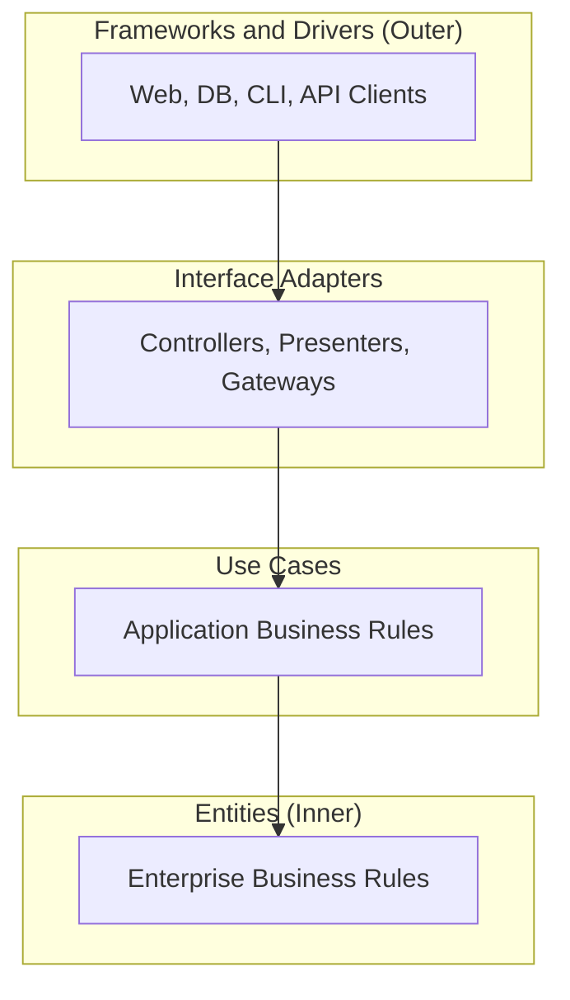

# Clean Architecture

This rule encodes Robert C. Martin's Clean Architecture for use in this codebase. Read this rule before adding code that touches multiple layers or introducing new dependencies. Also consult it before importing frameworks into modules containing business rules.

The goal is one constraint that everything else falls out of: the dependency rule. When that rule holds, the codebase stays testable, replaceable at the edges, and free of accidental coupling. When it breaks, frameworks and storage details bleed into the parts of the system that should be most stable.

Use this rule alongside the existing AGENTS.md guidance. Where this rule and AGENTS.md overlap, AGENTS.md wins on agent and skill mechanics; this rule wins on dependency direction.

## The Dependency Rule

Source code dependencies point inward. Outer layers know about inner layers. Inner layers know nothing about outer layers.

The four canonical layers, from outer to inner:

1. **Frameworks and Drivers** (outermost). Web servers, CLI hosts, database engines, message brokers, GitHub API clients, MCP transports, file systems.
2. **Interface Adapters**. Code that converts data between the form most convenient for the inner layers and the form most convenient for some outer detail. Controllers, presenters, gateways, mappers, serializers.
3. **Use Cases** (also called application services). Application-specific business rules. Each use case is one named operation the system performs on behalf of a caller.
4. **Entities** (innermost). Enterprise-wide business rules. The objects, invariants, and policies that would still be true if you replaced the database, the UI, and the framework tomorrow.

Concrete consequences:

- Entity code does not import from use cases, adapters, or frameworks.
- Use case code does not import from adapters or frameworks. It depends only on entities and on abstract ports it owns.
- Adapter code may import from use cases and entities. It may not be imported by them.
- Framework and driver code is invisible to the rest of the system except through adapter seams.

If you find yourself writing `from infra.x import Y` inside a domain module, stop. Either Y belongs in the domain, or the domain should depend on an interface that infra implements.

## Entities

Entities are the things the business cares about regardless of how the system is delivered. Sessions, agents, runs, plans, decisions. They own:

- The data that defines them.
- The invariants that keep that data consistent.
- The behavior that enforces those invariants.

Rules:

- Entities have no knowledge of persistence, transport, serialization, or UI. No ORM base classes, no framework decorators, no JSON shapes inferred from a schema generator.
- Entities do not import from use cases, adapters, or frameworks. They may import from other entities and from primitive types.
- Entity behavior is expressed as methods on the entity. A "manager" or "handler" that mutates an entity from the outside is a smell; the rule it enforces belongs on the entity.
- Identity is explicit. An entity has a typed identifier (`SessionId`, `AgentId`, `RunId`), not a bare string passed by convention.
- Validation that protects an invariant lives in the entity. Validation that protects an external surface (HTTP, CLI args) lives at that surface.

Smell: an entity is a record with all public fields and no methods, and every rule about it is enforced from outside. That is an Anemic Domain Model. Push behavior down before adding more services.

## Use Cases

A use case is one named operation the application performs: `OpenSession`, `RecordHandoff`, `ApproveAgentRun`, `MergeReviewedPullRequest`. Each use case is a thin orchestrator that loads entities, calls their methods, and persists the result.

Apply when:

- A request crosses more than one entity or aggregate.
- A request must be transactional, retryable, or auditable as one step.
- More than one entry point (CLI, HTTP, agent skill, hook) needs to invoke the same operation without duplicating logic.

Rules:

- Each use case has one public entry point. Name it for what the user or the system asked for, not for its implementation.
- Use cases depend on entities directly and on abstract ports for everything else. Repositories, clocks, ID generators, external clients, all arrive as injected interfaces defined in or near the use case.
- The use case decides when to commit. It opens the unit of work, runs the steps, and commits or rolls back at its boundary.
- Cross-cutting concerns attach here: authorization, idempotency keys, structured logging, metric emission, retry policy. They do not attach to entities and they do not attach to adapters.
- Use cases do not import from adapters or frameworks. If a use case mentions an HTTP status code, a SQL dialect, or a GitHub API field, it has reached too far.

A use case method should be short. If it grows past a screen, the operation is doing too much. Split it into a domain method on an entity, a smaller use case, or a helper that lives at the same layer.

## Interface Adapters

Adapters are the translation layer. They convert outer formats into shapes the inner layers expect and inner shapes into formats the outer world expects. Examples in this codebase: GitHub skill wrappers, MCP request and response handlers, JSON serializers for session logs, CLI argument parsers, hook payload deserializers.

Rules:

- Adapters import from use cases and entities. The reverse is forbidden.
- An adapter is the only place that knows the wire format. Once data crosses inward through an adapter, it is a domain object; once it crosses outward, it is a wire shape.
- Adapter input is treated as untrusted. Validate, normalize, and reject malformed input at the adapter boundary. Past that point, downstream code may assume well-formed data.
- ORM rows, API response objects, framework request types, and protocol envelopes do not flow inward past the adapter. Map them.
- Mapping is explicit and symmetric. `to_domain(record)` and `to_record(domain)` are paired and round-trippable in tests.
- An adapter that calls another adapter is fine. An adapter that reaches into a use case's internal state is not.

Smell: a controller method that builds a SQL query, calls the database, formats a response, and emits a metric is doing the work of a use case. Move the orchestration inward; keep the controller thin.

## Frameworks and Drivers

The outermost layer contains components that change when vendors or protocols are replaced. This includes web frameworks, database engines, the GitHub API, MCP transports, and file system access.

Rules:

- Framework code is configured at the edge of the program (`main`, the CLI entry point, the bootstrap function). It is wired to inner layers through adapter interfaces.
- Inner layers do not know which framework is in use. Swapping `requests` for `httpx`, swapping a SQL store for an in-memory one, or swapping one MCP server for another should be a one-file change at the bootstrap.
- Configuration values (timeouts, retry counts, feature flags) are loaded at the edge and passed inward as plain values. The domain does not read environment variables.
- Concurrency primitives (threads, async runtimes, background workers) are framework concerns. Use cases run in a sequential, transactional style; the framework decides how many of them run at once.

If framework idioms leak inward, draw a new adapter and route the call through it. This prevents decorators or ORM types from polluting the domain layer.

## Boundary Protection

Every boundary in the system is a place where dependencies could leak. The rules below keep them from leaking.

- **Direction by name**: when an inner module wants to call an outer one, define an interface in the inner module and let the outer module implement it. Outer modules import the interface; inner modules never import the implementation.
- **Plain types at the seam**: data that crosses a boundary is plain. Primitives, dataclasses, typed identifiers, value objects. No SQLAlchemy rows, no Pydantic models tied to an HTTP schema, no framework futures.
- **One owner per concept**: each concept (Session, Agent, Run) has exactly one canonical type in the inner layer. Adapters map to and from that type. Two competing types for the same concept across layers is a sign the boundary is missing.
- **Explicit ports**: use cases depend on abstract ports for external needs like time, IDs, or HTTP calls. Define these ports alongside the use case. Concrete implementations live in adapter or framework layers.
- **No ambient access**: no module reaches a global database handle, environment variable, or singleton client to do its work. Dependencies arrive as constructor or function parameters.
- **Tests respect direction**: a test that needs to fake the database does so by substituting an adapter implementation, not by patching a use case to skip a step.

A useful check: open any inner-layer file. Look at its imports. If the only names you see are standard library, typing primitives, and other inner-layer modules, you are inside the boundary. If you see a framework name, an HTTP client, or a serialization library, the boundary is broken.

## Pattern Selection

The dependency rule does not require all four layers in every component. Pick the smallest structure that keeps the rule intact.

- **Single-file script with no business rules**: one file is enough. The script is its own framework and its own use case. Do not invent layers to satisfy the diagram.
- **One aggregate, one store, simple invariants**: an entity plus a thin repository plus a use case is plenty. Skip the explicit adapter if the repository is already at the seam.
- **Multiple aggregates per use case, transactional integrity**: full structure. Entity, use case, repository ports, adapter implementations, framework wiring at the edge.
- **Stable schema, evolving rules**: invest in the entity and use-case layers; let the adapter and framework layers stay thin.
- **Stable rules, evolving schema or transports**: invest in the adapter layer. Multiple mappers can target the same domain types as the outer world changes.

If the work in front of you adds two layers but no new behavior, you are stacking patterns. Delete a layer until each one earns its keep.

## Anti-Patterns

These shapes appear in greenfield code more often than they should. Reject them in review and propose a fix.

- **Anemic Domain Model with thick services**: entities are bags of getters and setters; every rule lives in a service. Push the rule onto the entity that owns the data.
- **Smart UI / Smart Skill / Smart Hook**: business logic embedded in an entry point. Promote it to a use case; keep the entry point to parsing inputs, calling the use case, and formatting output.
- **Reverse import**: an entity or use case imports from an adapter or framework module. Invert the dependency: define a port, let the outer module implement it.
- **Leaky type at the boundary**: a public method on a use case takes or returns a SQLAlchemy row, a Pydantic HTTP model, or a `requests.Response`. Replace the parameter with a domain type and map at the adapter.
- **Ambient configuration**: domain code reads environment variables, calls `os.getenv`, or reaches into a global settings object. Pass configuration as plain values from the bootstrap.
- **Cross-aggregate transaction stretched across layers**: a use case that papers over a missing aggregate boundary by holding a long transaction across several services. Redraw the boundary; do not lengthen the transaction.
- **Framework decorators on entities**: ORM base classes, HTTP route decorators, or serialization decorators applied to domain types. Move the framework binding to a separate adapter type and map between them.
- **Layer for its own sake**: a pass-through class whose only job is to call the next layer. If it never varies and never gets tested in isolation, delete it.

## Boundaries with the ai-agents Codebase

This codebase already has implicit versions of these layers. Reuse them; do not duplicate.

- **Entities and domain rules**: session state, agent definitions, ADRs and governance constraints, plan and decision records. These are the things that should outlive any framework or transport choice. Keep them free of MCP, GitHub, and CI specifics.
- **Use cases**: the orchestrator agent, lifecycle skills (`/spec`, `/plan`, `/build`, `/test`, `/review`, `/ship`), and session-lifecycle skills (`session-init`, `session-end`). Each is a named operation that loads domain state, calls domain methods, and commits a single change. New cross-cutting operations belong here, not inside hooks or wire-format scripts.
- **Interface adapters**: GitHub skill wrappers, MCP client wrappers, the session-log JSON schema, hook payload parsers, lint and validation runners. Treat these as the only place wire shapes exist. Do not let GitHub API field names or MCP envelope keys flow into agent prompts or domain modules.
- **Frameworks and drivers**: GitHub Actions runners, the gh CLI, Serena and Forgetful MCP servers, the file system layout, Python and Node toolchains. Bootstrap them at the edge. Inner layers depend on adapter ports, not on these.
- **Boundary guardian**: the `architect` agent is the designated reviewer for boundary changes. Architecture changes are listed under "Ask First" in AGENTS.md; treat any reverse-import or leaky-type fix as architecture work and route it through architect review.

When you touch a file that today violates this rule, prefer a focused refactor on the path you are already changing over a sweeping rewrite. Note the deviation in the PR description so future readers see the trade-off.

## Quick Self-Review

Before opening a PR that crosses or creates a layer boundary, walk this list.

- Do entity files import only from other entities and standard types?
- Do use cases depend on ports defined alongside them, not on concrete adapters or framework types?
- Does every wire shape (HTTP body, MCP envelope, ORM row, GitHub API response) get mapped at an adapter before reaching a use case?
- Is each use case named for what the system does, and does it commit at its own boundary?
- Are framework choices (database, transport, runner) configured at one bootstrap location and reachable everywhere else only through ports?
- Could you replace one framework or external service in the outermost layer without changing entity or use case code?
- If you added a new layer or class, does it carry behavior, vary independently, and get tested in isolation? If not, delete it.

If any answer is "no" or "not sure," fix the design before review. Adhering to these checks ensures architectural integrity.
