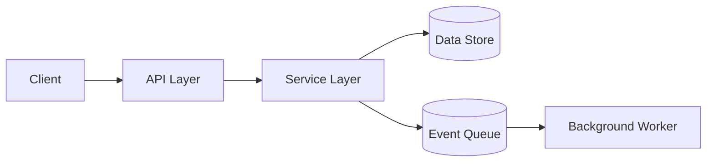

# Architecture

## Overview

[Two or three paragraphs that describe what the system does, the major moving parts, and the user-visible boundary. A reader should leave this section knowing the shape of the system without reading further.]

## Goals and Non-Goals

### Goals

- [Goal one. State the outcome, not the implementation.]
- [Goal two.]
- [Goal three.]

### Non-Goals

- [What the system intentionally does not do. Reviewers cite this when feature creep appears.]
- [Another non-goal.]

## System Diagram

[Replace the example with a diagram of the real system. Keep it readable on a phone screen. If the diagram needs more than ten nodes, split it.]

## Components

| Component | Responsibility | Owns | Depends On |
|-----------|----------------|------|------------|
| `[Component A]` | [One sentence] | [What state or data] | [Component B, External X] |
| `[Component B]` | [One sentence] | [What state or data] | [Component C] |
| `[Component C]` | [One sentence] | [What state or data] | [None] |

## Data Flow

A typical request flows as follows:

1. [Client sends request to component A.]
2. [Component A validates and forwards to component B.]
3. [Component B reads or writes the data store.]
4. [Component B emits an event for asynchronous processing.]
5. [Background worker consumes the event.]
6. [Result is returned to the client (or written to the store the client reads).]

## Design Decisions

Material decisions live in [`docs/adr/`] (or equivalent). Each ADR captures context, decision, and consequences. Add a new ADR when:

- A boundary changes between components.
- A dependency is added, removed, or replaced.
- A consistency or durability guarantee changes.

## Extension Points

| Where | How to extend | Example |
|-------|---------------|---------|
| `[Plugin interface]` | [What to implement] | [Concrete example name] |
| `[Webhook]` | [Event shape and delivery] | [Concrete example] |

## Failure Modes

| Failure | Detection | Mitigation |
|---------|-----------|------------|
| `[Data store unavailable]` | [Health check, timeouts] | [Circuit break, queue write, retry policy] |
| `[Worker backlog]` | [Queue depth metric] | [Bound the queue; alert at threshold] |
| `[Upstream API outage]` | [Error rate over window] | [Circuit breaker, fallback, surface degraded mode] |

## Operational Notes

- **Deploy**: [Where, how often, who can roll back.]
- **Observability**: [Where logs, metrics, and traces live.]
- **On-call runbook**: [Path to runbook and primary contacts.]
- **Capacity**: [Known limits and how to raise them.]
