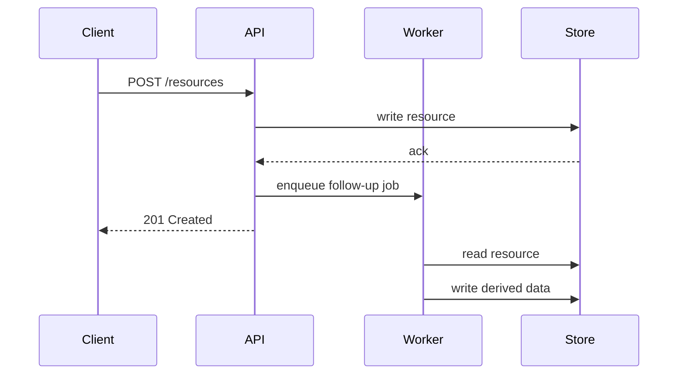

# Visual Aids Guide

Visuals exist to reduce ambiguity. If a sentence already says it clearly, a diagram adds noise. Apply the rules below to decide what helps and what does not.

## When to Use a Diagram

Use a diagram when:

- A reader must hold more than three relationships in their head at once.
- The order of steps matters and the steps span multiple components.
- A boundary or interface is the point of the section.

Do not use a diagram when:

- The text is already clear.
- The diagram would have one or two nodes.
- The diagram would only restate the table next to it.

## Mermaid Sequence Example



A sequence diagram earns its keep when the order of calls is the point. If the order does not matter, use a flowchart or skip the diagram.

## Tables

Use a table when:

- You compare two or three things across the same set of attributes.
- The same shape repeats: option name, default, description.

### Comparison Example

| Strategy | Latency | Consistency | Best For |
|----------|---------|-------------|----------|
| Synchronous write | High | Strong | Money, identity |
| Asynchronous write | Low | Eventual | Analytics, logs |
| Cached read | Lowest | Bounded staleness | Hot reads with tolerance |

Three columns plus a name column is a good ceiling. Past five columns, switch to bullets per item.

## Code Samples

- Show the smallest sample that conveys the idea. Trim setup that is not the point.
- Pair input with output so the reader does not guess.
- Use language identifiers on opening fences (`` ```python ``) so renderers and linters work.
- Closing fences are bare (`` ``` ``). Identifiers on closing fences break parsers.

## Callouts

Use callouts sparingly. Three styles cover most needs.

> **Note**: Background a reader needs to interpret what follows.
>
> **Warning**: Action that produces irreversible or expensive effects.
>
> **Tip**: Optional shortcut for readers who already know the basics.

## Anti-Patterns

| Avoid | Why | Instead |
|-------|-----|---------|
| Decorative diagrams | Add visual noise without information | Cut the diagram |
| Diagrams that restate a table | Two views of the same data; readers guess which is current | Pick one |
| Screenshots of terminals | Cannot be searched; rot when the UI changes | Paste the text |
| Diagrams with more than ten nodes | Overflow the screen on phones; readers stop tracking | Split into two |
| Different diagram styles in the same doc | Distracts from content | Pick one tool and stick with it |

## Self-Review

- [ ] Each diagram reduces ambiguity that the prose did not already remove.
- [ ] Tables have at most one row of headers and four to five columns.
- [ ] Code blocks have language identifiers on the opener; closing fences are bare.
- [ ] Callouts use one of `Note`, `Warning`, `Tip`.
- [ ] Mermaid blocks render without syntax errors.
