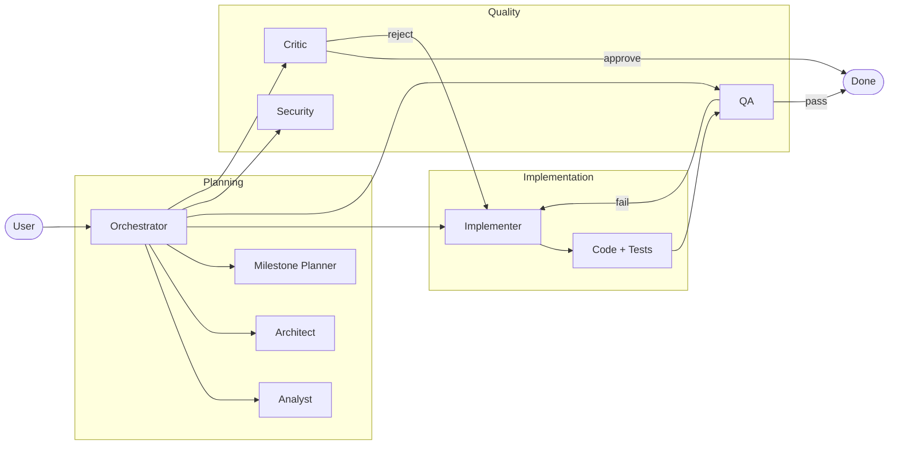

# AI Agent System

For platform teams, engineering managers, and orgs that want AI-assisted development with real governance. Session protocol, review gates, and ADR-steered agent behavior built in.

[](https://deepwiki.com/rjmurillo/ai-agents)


---

## Fastest Start

Each AI tool has its own native marketplace flow. This repo ships a Claude Code marketplace at `.claude-plugin/marketplace.json` and a Copilot CLI marketplace at `.github/plugin/marketplace.json`, so the same repository URL works in both CLIs. Pick yours and paste the command(s) inside the CLI session.

**Claude Code.** One command installs the full set; restart Claude Code when it finishes.

```text
/install-plugin rjmurillo/ai-agents
```

**GitHub Copilot CLI.** Two steps: register the marketplace, then install the Copilot-targeted toolkit. No restart needed afterward; Copilot CLI picks agents up automatically.

```text
/plugin marketplace add rjmurillo/ai-agents
/plugin install project-toolkit@ai-agents
```

A Claude install lands 23 agents, 23 commands, 29 hooks, and 69 skills. A Copilot install lands 24 agents, 28 hooks, and 81 skills generated from the same canonical sources. See [Verify Installation](#verify-installation) for the per-tool sanity check, or [More Installation Options](#alternative-full-installation) for component-level installs (agents only, etc.).

### What You Get

| Component | Claude Code | Copilot CLI |
|-----------|-------------|-------------|
| Agents | 23 | 24 |
| Skills | 69 | 81 |
| Slash commands | 23 | n/a (interactive only) |
| Lifecycle hooks | 29 | 28 |
| Session protocol | 1 | 1 |
| Review gates | 5 | 5 |

Specialized agent roles include analyst, architect, implementer, QA, security, devops, and more. See the [Agent Catalog](#agent-catalog) for the full list.

### Troubleshooting

- **`/install-plugin` not recognized:** That command is Claude Code only. In Copilot CLI use the two-step flow (`/plugin marketplace add rjmurillo/ai-agents` then `/plugin install project-toolkit@ai-agents`).
- **Copilot CLI install fails with "No plugin.json found in repository":** This repo is a marketplace, not a single plugin. Run `/plugin marketplace add rjmurillo/ai-agents` first, then `/plugin install project-toolkit@ai-agents`.
- **`/plugin` not recognized in Copilot CLI:** Update Copilot CLI to a recent stable release; plugin support is required. Run `copilot --version` in a regular terminal to check.
- **Plugin install fails or hangs:** Confirm your AI tool is on a recent stable release that supports the install command, then retry. Check the version per tool: in Claude Code use `/version` or the title bar; for Copilot CLI run `copilot --version` in a regular terminal.
- **Agents not responding after install:** Restart Claude Code (Copilot CLI does not need a restart). Then verify with `Task(subagent_type="analyst", prompt="Hello, are you available?")` in Claude Code, `copilot plugin list` in Copilot CLI to confirm `project-toolkit@ai-agents` is installed, or `@orchestrator Hello, are you available?` in VS Code Copilot Chat.

---

## Where to Start

| I want to... | Go to |
|--------------|-------|
| **Use the agents right now** | [Fastest Start](#fastest-start) (above) |
| **Understand how it works** | [Key Concepts](#key-concepts) |
| **Contribute or modify agents** | [Developer Setup](#developer-setup) |
| **See all available agents** | [Agent Catalog](#agent-catalog) |
| **Full installation options** | [Alternative: Full Installation](#alternative-full-installation) |

---

## Table of Contents

- [AI Agent System](#ai-agent-system)
  - [Fastest Start](#fastest-start)
    - [What You Get](#what-you-get)
    - [Troubleshooting](#troubleshooting)
  - [Where to Start](#where-to-start)
  - [Table of Contents](#table-of-contents)
  - [Purpose and Scope](#purpose-and-scope)
    - [What is AI Agents?](#what-is-ai-agents)
    - [Core Capabilities](#core-capabilities)
    - [Key Concepts](#key-concepts)
  - [Alternative: Full Installation](#alternative-full-installation)
    - [Quick Install (CLI marketplace)](#quick-install-cli-marketplace)
    - [Verify Installation](#verify-installation)
    - [Supported Platforms](#supported-platforms)
  - [Quick Start](#quick-start)
    - [Examples](#examples)
      - [Simple Scenarios](#simple-scenarios)
      - [Advanced Scenarios](#advanced-scenarios)
  - [Lifecycle Commands](#lifecycle-commands)
  - [System Architecture](#system-architecture)
    - [How Agents Work Together](#how-agents-work-together)
    - [Agent Catalog](#agent-catalog)
    - [Directory Structure](#directory-structure)
  - [Additional Troubleshooting](#additional-troubleshooting)
  - [Contributing](#contributing)
    - [Developer Setup](#developer-setup)
    - [Agent Development](#agent-development)
  - [Documentation](#documentation)
  - [License](#license)

---

## Purpose and Scope

### What is AI Agents?

AI Agents is a coordinated multi-agent system for software development. It provides specialized AI agents that handle different phases of the development lifecycle, from research and planning through implementation and quality assurance.

The orchestrator is the hub of operations. Within it has logic from taking everything from a "vibe" or a "shower thought" and building out a fully functional spec with acceptance criteria and user stories, to taking a well defined idea as input and executing on it. The Claude bundle ships 23 agents and the Copilot bundle ships 24 agents that cover the roles of software development, from vision and strategy, to architecture, implementation, and verification. Each role looks at something specific, like the critic that just looks to poke holes in other agents' (or your own) work, or DevOps that's concerned about how you deploy and operate the thing you just built.

The agents themselves use the platform specific handoffs to invoke subagents, keeping the orchestrator context clean. A great example of this is orchestrator facilitating creating and debating an [Architectural Decision Record](https://adr.github.io/) from research and drafting, to discussion, iterating on the issues, tie breaking when agents don't agree. And then  extracting persistent knowledge to steer future agents to adhere. Artifacts are stored in your memory system if you have one enabled, and Markdown files for easy reference to both agents and humans.

### Core Capabilities

- **23+ specialized agents** for different development phases (analysis, architecture, implementation, QA, etc.)
- **Explicit handoff protocols** between agents with clear accountability
- **Multi-Agent Impact Analysis Framework** for comprehensive planning
- **Cross-session memory** with citation verification, graph traversal, and health reporting via Serena + Forgetful
- **Self-improvement system** with skill tracking and retrospectives
- **Quality gates** with pre-PR validation, session protocol enforcement, and automated CI checks
- **69+ reusable skills** for common development workflows (git, PR management, testing, linting)
- **One-step plugin install** through Claude Code's `/install-plugin` or Copilot CLI's `/plugin marketplace add` flow
- **AI-powered CI/CD** with issue triage, PR quality gates, and spec validation

### Key Concepts

| Term | Definition |
|------|------------|
| **Agent** | A specialized AI persona with a defined role (analyst, implementer, security, etc.) |
| **Orchestrator** | The coordinating agent that routes tasks to specialists and synthesizes results |
| **Handoff** | Explicit transfer of context and control between agents with clear accountability |
| **Skill** | A reusable workflow component for common tasks (69+ included: git, PR, testing, linting) |
| **Memory** | Cross-session context persistence via Serena + Forgetful for knowledge retention |
| **ADR** | Architectural Decision Record, structured documents capturing design decisions |
| **Quality Gate** | Validation checkpoint (critic review, QA pass, security scan) before proceeding |

---

## Alternative: Full Installation

The [Fastest Start](#fastest-start) above is the recommended path. Use the commands below when you want component-level control (agents only, no skills, etc.).

> See [CONTRIBUTING.md](CONTRIBUTING.md#prerequisites) for development setup including Python 3.14.x, pre-commit hooks, and test dependencies. Day-to-day plugin use does not need either.

### Quick Install (CLI marketplace)

The [Fastest Start](#fastest-start) commands install the full toolkit. For component-level installs, register the marketplace once in the CLI you are using and then install just the parts you want. Claude Code resolves that repository to `.claude-plugin/marketplace.json`; Copilot CLI resolves it to `.github/plugin/marketplace.json`. In Claude Code you can also use `/install-plugin rjmurillo/ai-agents` as a one-step shortcut that registers the marketplace and prompts for plugin selection.

**Claude Code:**

```text
/plugin marketplace add rjmurillo/ai-agents
```

| Component | Install Command | What You Get |
|-----------|----------------|--------------|
| Claude agents only | `/plugin install claude-agents@ai-agents` | 24 agent definitions from `src/claude/` (no skills, commands, or hooks) |
| Project toolkit | `/plugin install project-toolkit@ai-agents` | 23 agents, 23 slash commands, 29 hooks, and 69 reusable skills from `.claude/` |

**GitHub Copilot CLI:**

```text
/plugin marketplace add rjmurillo/ai-agents
```

| Component | Install Command | What You Get |
|-----------|----------------|--------------|
| Copilot full toolkit | `/plugin install project-toolkit@ai-agents` | 24 agents, 28 hooks, 81 skills from `src/copilot-cli/` (Copilot CLI) |

Claude exposes both an agents-only bundle (`claude-agents`, from `src/claude/`) and the full toolkit (`project-toolkit`, from `./.claude`); the latter ships 23 agents because `src/claude/` and `.claude/agents/` are two different curated sets, kept in sync where they overlap. Copilot CLI installs ship a single `project-toolkit` plugin from `src/copilot-cli/` because that directory's `plugin.json` declares one identity; an agents-only Copilot install would silently register as `project-toolkit` and is therefore not advertised (issue #1840).

### Verify Installation

After installing, confirm the agents are loaded.

**Claude Code:**

```text
Task(subagent_type="analyst", prompt="Hello, are you available?")
```

**GitHub Copilot CLI:**

```bash
copilot plugin list
```

The output should include `project-toolkit@ai-agents` (or whichever component you installed). To exercise an agent end-to-end, run `copilot -p "analyst: respond with 'available'"`.

**VS Code (Copilot Chat):**

```text
@orchestrator Hello, are you available?
```

### Supported Platforms

| Platform | Agent Location | Usage |
|----------|---------------|-------|
| **Claude Code CLI** | `src/claude/` | Use `Task(subagent_type="...")` |
| **GitHub Copilot CLI** | `src/copilot-cli/` | Use `--agent` flag, `/agent` to select, or call out agent by name |
| **VS Code / GitHub Copilot** | `src/vs-code-agents/` | Use `@agent` syntax in Copilot Chat |

See [docs/installation.md](docs/installation.md) for complete installation documentation, including platform-specific paths, troubleshooting, and post-installation steps.

---

## Quick Start

After installing the agents with the method of your choice, you can either select one of them explicitly, ask your LLM to use the agent by name, or even prefix your input with the name of the agent.

### Examples

Here are prompts you can copy and paste. Prefix with the agent name to route directly, or use the orchestrator for multi-step workflows.

#### Simple Scenarios

Review code quality:

> critic: review @src/auth/login-handler.ts for coupling, error handling gaps, and test coverage. Deliver an APPROVE or REJECT verdict with specific line references.

Shows the critic agent doing a focused code review.

Investigate a bug:

> analyst: the /api/users endpoint returns 500 when the email contains a plus sign. Trace the request through the handler, identify the root cause, and propose a fix.

Shows the analyst doing root cause analysis on a specific bug.

Scan for vulnerabilities:

> security: scan @src/api/ for OWASP Top 10 vulnerabilities. Focus on injection, broken auth, and data exposure. Output a threat matrix with CWE identifiers and severity ratings.

Shows the security agent doing a targeted scan.

Write tests for existing code:

> qa: write pytest tests for @scripts/validate_session_json.py. Cover happy path, malformed input, missing required fields, and boundary conditions. Target 95% line coverage.

Shows the QA agent generating tests with specific coverage targets.

Document a module:

> explainer: document @scripts/memory_enhancement/ as a user guide. Include purpose, installation, CLI usage with examples, and architecture overview. Write for developers who have never seen this codebase.

Shows the explainer creating developer documentation.

Plan a feature:

> milestone-planner: break down "add webhook retry with exponential backoff" into milestones. Include acceptance criteria, estimated complexity, dependencies, and a suggested implementation order.

Shows the planner creating structured work packages.

#### Advanced Scenarios

End-to-end feature pipeline:

> orchestrator: build the webhook retry system described in @.agents/specs/webhook-retry.md. Start with analyst to verify requirements. Then milestone-planner to create work packages. Run critic to stress-test the plan. Then implementer to write code and tests. Run qa to verify coverage meets acceptance criteria. Run security to scan for injection and replay risks. Fix all critical findings recursively until critic, qa, and security pass. Open a PR.

The orchestrator chains seven agents into a full development pipeline with quality gates at each stage.

Architecture review:

> orchestrator: conduct a full review of @docs/architecture/service-mesh.md. Route through analyst for data accuracy, architect for structural decisions, security for threat modeling with CWE/CVSS ratings, critic to stress-test for gaps, and independent-thinker to challenge assumptions. Synthesize all findings into a single summary highlighting consensus and disagreements.

Five agents examine the same artifact through different lenses. The orchestrator synthesizes their independent assessments.

Debug, fix, and ship:

> orchestrator: the payment webhook handler drops events when Redis is unavailable. Have analyst investigate the failure pattern in the logs. Then architect propose a resilient design with fallback queuing. Then implementer build the fix with tests. Run qa and security to validate. Open a PR when all checks pass.

Turns an incident report into a shipped fix through structured agent collaboration.

Technology migration evaluation:

> orchestrator: we are considering migrating from REST to gRPC for internal services. Route through analyst to research benchmarks and ecosystem maturity. Then architect to map impact on existing contracts. Then security to threat-model the new transport layer. Then devops to estimate CI/CD changes. Then independent-thinker to argue the strongest case for staying with REST. Then high-level-advisor to deliver a GO or NO-GO verdict with conditions.

Six agents build a decision package. Each contributes a different dimension of analysis. The advisor synthesizes everything into an actionable verdict.

Strategic prioritization:

> orchestrator: we have three candidate features for next quarter: plugin marketplace, offline mode, and admin audit logging. For each, run analyst for effort and risk, roadmap to score with RICE and KANO, security for compliance implications, and devops for operational burden. Then independent-thinker to argue which one we will most regret skipping. Then high-level-advisor to rank all three with a clear recommendation.

The orchestrator runs the same evaluation pipeline across all candidates, producing comparable data for a defensible quarterly plan.

---

## Lifecycle Commands

Six slash commands that map to the development lifecycle. Each one activates the right agents and quality gates automatically.

```text
  DEFINE          PLAN           BUILD          VERIFY         REVIEW          SHIP
 ┌──────┐      ┌──────┐      ┌──────┐      ┌──────┐      ┌──────┐      ┌──────┐
 │ Idea │ ───> │ Spec │ ───> │ Code │ ───> │ Test │ ───> │  QA  │ ───> │  Go  │
 │Refine│      │  PRD │      │ Impl │      │Debug │      │ Gate │      │ Live │
 └──────┘      └──────┘      └──────┘      └──────┘      └──────┘      └──────┘
  /spec          /plan          /build        /test         /review       /ship
```

| What you're doing | Command | What happens |
|-------------------|---------|--------------|
| Define what to build | `/spec` | CVA analysis, testable acceptance criteria, critic review |
| Plan how to build it | `/plan` | Milestones, atomic tasks (S/M/L), dependency graph, risk register |
| Build incrementally | `/build` | TDD slices, atomic commits, code quality scoring |
| Prove it works | `/test` | 6 quality gates (functional, non-functional, security, DevOps, DX, observability) |
| Review before merge | `/review` | 5-axis review (architecture, security, quality, tests, standards) |
| Ship to production | `/ship` | Pre-flight checks, PR creation, ship report |

Each command chains to the next. Output from `/spec` feeds into `/plan`, which feeds into `/build`, and so on. You can also jump in at any point for smaller tasks.

**Standard feature:**

```text
/spec Add OAuth2 login flow with JWT tokens
/plan
/build
/test
/review
/ship
```

**Quick fix:**

```text
/build Fix null reference in UserService.GetById
/test
/ship
```

See [docs/workflow-commands.md](docs/workflow-commands.md) for the full command reference.

---

## System Architecture

### How Agents Work Together

The orchestrator coordinates specialized agents through explicit handoffs. Each agent focuses on its domain, and the orchestrator synthesizes results.



**Typical flow:**

1. **User** describes a task to the **Orchestrator**
2. **Orchestrator** routes to **Analyst** for research and feasibility
3. **Architect** designs the solution; **Milestone Planner** breaks it into work packages
4. **Implementer** writes code and tests
5. **QA** and **Security** validate; **Critic** stress-tests the approach
6. On approval, work is complete; on failure, it loops back for fixes

### Agent Catalog

The Claude Code bundle ships 23 agents and the Copilot CLI bundle ships 24 (Copilot adds `backlog-generator`; both bundles include the rest). `spec-generator` is now a skill (issue #2001), available in both bundles. Both bundles share the same templates.

| Agent | Purpose | Output | Bundle |
|-------|---------|--------|--------|
| **orchestrator** | Task coordination and routing | Delegated results from specialists | both |
| **analyst** | Research, feasibility analysis, trade-off evaluation | Quantitative findings with evidence | both |
| **architect** | System design evaluation, ADRs, pattern enforcement | Rated assessments (Strong/Adequate/Needs-Work) | both |
| **milestone-planner** | Milestones and work packages | Implementation plans with acceptance criteria | both |
| **implementer** | Production code and tests | Code, tests, commits | both |
| **critic** | Plan stress-testing, gap identification | Verdicts: APPROVE / APPROVE WITH CONDITIONS / REJECT | both |
| **qa** | Test strategy and verification | Test reports, coverage analysis | both |
| **security** | Threat modeling, vulnerability assessment | Threat matrices with CWE/CVSS ratings | both |
| **devops** | CI/CD pipelines, operational planning | Infrastructure configs, maintenance estimates | both |
| **roadmap** | Strategic prioritization, RICE/KANO analysis | Priority stacks, cost-benefit analysis | both |
| **retrospective** | Learning extraction | Actionable insights, skill updates | both |
| **memory** | Cross-session context | Retrieved knowledge, stored observations | both |
| **skillbook** | Skill management | Atomic strategy updates | both |
| **explainer** | PRDs and documentation | Specs, user guides | both |
| **task-decomposer** | Atomic task breakdown | Estimable work items with done criteria | both |
| **high-level-advisor** | Strategic decisions, unblocking | Verdicts: GO / CONDITIONAL GO / NO-GO | both |
| **independent-thinker** | Challenge assumptions, devil's advocate | Counter-arguments with alternatives | both |
| **pr-comment-responder** | PR review handling | Triaged responses, resolution tracking | both |
| **debug** | Debugging assistance, root cause analysis | Diagnostic findings with resolution steps | both |
| **janitor** | Code and documentation cleanup | Refactoring and cleanup suggestions | both |
| **issue-feature-review** | Feature-request triage on GitHub issues | Constructive verdict with next steps | both |
| **merge-resolver** | Resolve git/PR merge conflicts | Pattern-based resolution plan | both |
| **negotiation** | Offer analysis and counter-proposals | Value-gap analysis with RADAR protocol | both |
| **backlog-generator** | Proactive task discovery when idle | Sized tasks from project state analysis | Copilot CLI only |

See [AGENTS.md](AGENTS.md) for detailed agent documentation.

### Directory Structure

```text
ai-agents/
├── src/
│   ├── vs-code-agents/      # VS Code / GitHub Copilot agents
│   ├── copilot-cli/         # GitHub Copilot CLI agents
│   └── claude/              # Claude Code CLI agents
├── templates/               # Agent template system
├── scripts/                 # Validation and utility scripts
├── docs/                    # Documentation
├── .agents/                 # Agent artifacts (ADRs, plans, etc.)
├── .claude-plugin/          # Claude Code marketplace manifest
├── .github/plugin/          # GitHub Copilot CLI marketplace manifest
├── .github/copilot-instructions.md  # GitHub Copilot instructions
├── CLAUDE.md                        # Claude Code instructions
└── AGENTS.md                        # Detailed usage guide
```

---

## Additional Troubleshooting

<details>
<summary><strong>Agent not responding or not found</strong></summary>

- **Restart your editor** after installation to reload agent definitions
- Verify installation with the [Verify Installation](#verify-installation) commands
- Check that you're using the correct syntax for your platform (`Task()` for Claude, `@agent` for VS Code)

</details>

<details>
<summary><strong>/install-plugin command not recognized</strong></summary>

- `/install-plugin` is a Claude Code CLI shortcut. In Copilot CLI use the explicit two-step flow:
  1. `/plugin marketplace add rjmurillo/ai-agents`
  2. `/plugin install project-toolkit@ai-agents`
- Ensure you're running inside Claude Code CLI or Copilot CLI, not a regular shell. The command is built into the AI tool.

</details>

<details>
<summary><strong>Python version errors when running tests</strong></summary>

- This project requires **Python 3.14.x** for development. End users installing the plugins do not need Python.
- The `.python-version` file pins the exact version (currently 3.14.4)
- See [CONTRIBUTING.md](CONTRIBUTING.md#prerequisites) for detailed setup

</details>

<details>
<summary><strong>Orchestrator not routing to agents correctly</strong></summary>

- Be explicit: prefix prompts with the agent name (e.g., `analyst: ...`)
- Check that agents were installed for your specific platform
- Review [Quick Start examples](#examples) for correct syntax

</details>

---

## Contributing

See [CONTRIBUTING.md](CONTRIBUTING.md) for detailed contribution guidelines.

### Developer Setup

If you're contributing code or running tests locally:

1. Fork and clone the repository
2. Install Python dependencies:

   ```bash
   # Create virtual environment (optional but recommended)
   uv venv
   source .venv/bin/activate  # On Windows: .venv\Scripts\activate

   # Install project with dev dependencies
   uv pip install -e ".[dev]"
   ```

3. Set up environment variables (copy `.env.example` to `.env` and fill in your API keys)
4. Enable pre-commit hooks: `git config core.hooksPath .githooks`
5. Run tests to verify setup:

   ```bash
   python -m pytest tests/ -v
   ```

6. Make changes following the guidelines
7. Submit a pull request

### Agent Development

This project uses a **template-based generation system**. To modify agents:

1. Edit templates in `templates/agents/*.shared.md`
2. Run `python build/generate_agents.py` to regenerate
3. Commit both template and generated files

**Do not edit files in `src/vs-code-agents/` or `src/copilot-cli/` directly.** See [CONTRIBUTING.md](CONTRIBUTING.md) for details.

---

## Documentation

| Document | Description |
|----------|-------------|
| [docs/getting-started.md](docs/getting-started.md) | Step-by-step setup guide |
| [docs/agent-catalog.md](docs/agent-catalog.md) | All agents with capabilities and examples (23 in Claude bundle, 24 in Copilot bundle) |
| [docs/skill-reference.md](docs/skill-reference.md) | All skills with usage descriptions (69 in Claude bundle, 81 in Copilot bundle) |
| [docs/architecture.md](docs/architecture.md) | Plugin structure, template system, design decisions |
| [docs/customization.md](docs/customization.md) | How to extend and customize agents, skills, and hooks |
| [docs/installation.md](docs/installation.md) | Complete installation guide |
| [docs/project-structure.md](docs/project-structure.md) | Annotated repo layout (what to edit vs generated) |
| [AGENTS.md](AGENTS.md) | Comprehensive usage guide |
| [CONTRIBUTING.md](CONTRIBUTING.md) | Contribution guidelines and agent development |
| [CLAUDE.md](CLAUDE.md) | Claude Code integration |
| [copilot-instructions.md](.github/copilot-instructions.md) | GitHub Copilot integration |
| [docs/workflow-commands.md](docs/workflow-commands.md) | Lifecycle commands (/spec, /plan, /build, /test, /review, /ship) |
| [docs/when-to-use.md](docs/when-to-use.md) | Fitness guide: which lifecycle phases fit which task shapes, and when the full lifecycle is overkill |
| [docs/ideation-workflow.md](docs/ideation-workflow.md) | Ideation workflow documentation |
| [docs/markdown-linting.md](docs/markdown-linting.md) | Markdown standards |

---

## License

MIT
