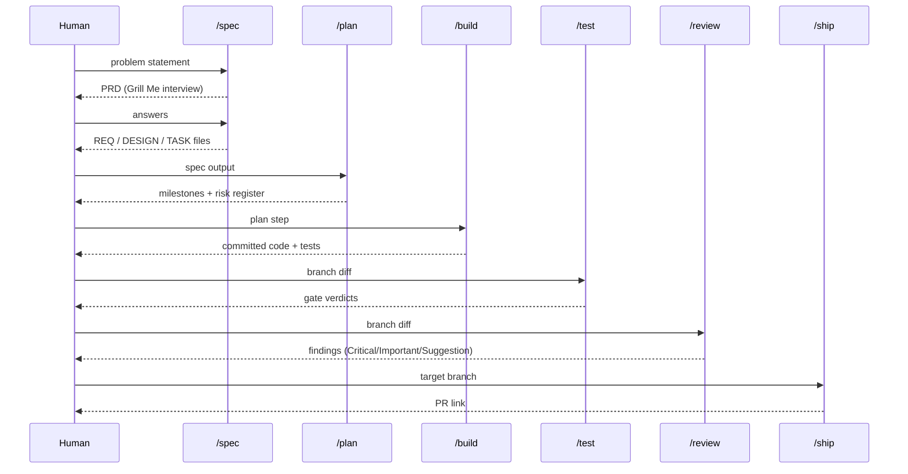

# Getting Started

This guide walks you through installing and using the AI Agents system in your project.

## Fastest Start

Each AI tool has its own native marketplace flow. This repo ships a Claude Code marketplace at `.claude-plugin/marketplace.json` and a Copilot CLI marketplace at `.github/plugin/marketplace.json`, so the same repository URL works in both CLIs. Pick yours and paste the command(s) inside the CLI session.

**Claude Code.** Use the one-step shortcut to register the marketplace and install the full Claude toolkit; restart Claude Code when it finishes.

```text
/install-plugin rjmurillo/ai-agents
```

**GitHub Copilot CLI.** Two steps: register the marketplace, then install the Copilot-targeted toolkit. No restart needed afterward.

```text
/plugin marketplace add rjmurillo/ai-agents
/plugin install project-toolkit@ai-agents
```

After install, verify agents loaded:

```text
analyst: Hello, are you available?
```

If the agent responds, you are ready. Skip to [Step 4: Use an Agent](#step-4-use-an-agent).

---

## Alternative: Full Installation

### Prerequisites

You need one of these AI coding tools:

- [Claude Code CLI](https://docs.anthropic.com/en/docs/agents-and-tools/claude-code/overview)
- [GitHub Copilot CLI](https://docs.github.com/en/copilot/how-tos/use-copilot-agents/use-copilot-cli)
- [VS Code with GitHub Copilot](https://marketplace.visualstudio.com/items?itemName=GitHub.copilot)

End users do not need Python or any build tooling to install the plugins. Contributors do; see [CONTRIBUTING.md](../CONTRIBUTING.md#prerequisites).

## Step 1: Install

The fastest method uses the built-in plugin marketplace. Run the commands below inside your AI coding tool (not a regular terminal). Claude Code reads the Claude marketplace manifest from this repo; Copilot CLI reads the Copilot marketplace manifest.

**Claude Code:**

```text
/install-plugin rjmurillo/ai-agents
```

**GitHub Copilot CLI:**

```text
/plugin marketplace add rjmurillo/ai-agents
/plugin install project-toolkit@ai-agents
```

The Copilot CLI flow also works from a regular shell: `copilot plugin marketplace add rjmurillo/ai-agents` then `copilot plugin install project-toolkit@ai-agents`.

This installs the full toolkit for your platform. The Claude bundle ships 23 agents, 23 commands, 29 hooks, and 69 skills. The Copilot bundle ships 24 agents, 28 hooks, and 81 skills. For selective installation (agents only, etc.), see [docs/installation.md](installation.md).

## Step 2: Understand the Workflow

The agents follow a 7-phase pipeline. Each phase has a defined input, a command to invoke, and a durable artifact it produces. Run phases in order; skipping phases is possible but reduces quality gates and increases the chance of rework.

### The 7-phase pipeline

| # | Phase | Command | What it does | Artifact produced | When to use |
|---|-------|---------|--------------|-------------------|-------------|
| 1 | Grill Me | `/spec` (requirements-interview) | Adversarial interview that walks the design tree before any code; proposes answers from the codebase | Structured PRD (Problem, User stories, Data model, Acceptance criteria) | Start here for every non-trivial feature |
| 2 | PRD to Spec | `/spec` (completion) | Formalizes the PRD into durable REQ/DESIGN/TASK files; runs analyst gap-check and critic pre-mortem | `.agents/specs/requirements/REQ-NNN-*.md`, `DESIGN-NNN-*.md`, `TASK-NNN-*.md` | After the interview resolves all open questions |
| 3 | Kanban | `/plan` | Decomposes specs into milestones with dependency ordering, risk register, and S/M/L sizing | Versioned execution plan artifact | After `/spec` output exists |
| 4 | Implement | `/build` | TDD vertical slices, atomic commits, code-quality self-check | Committed code plus passing tests | After `/plan` output exists |
| 5 | QA | `/test` | Six quality gates: functional, non-functional, security, DevOps, DX, observability | Gate verdicts table with PASS/WARN/CRITICAL_FAIL per gate | After `/build` completes a slice |
| 6 | Review | `/review` | Five-axis review: architecture, security, quality, tests, standards | Findings list (Critical, Important, Suggestion) with file:line citations | After `/test` passes |
| 7 | Ship | `/ship` | Pre-flight checks (pipeline, security, review, tests, standards) then PR creation | Ship report plus PR link | After `/review` has no unresolved Critical findings |

### Day Shift and Night Shift

The pipeline splits into two modes by who must be present:

- **Day Shift (human decision required):** Grill Me interview responses, PRD review, QA gate sign-off, ship decision
- **Night Shift (AFK or autonomous):** `/build` loops, `/test` gate runs, `/review` passes

### Pipeline at a glance



### Go deeper

- [Autonomous issue development](autonomous-issue-development.md) for running the full pipeline AFK
- [Ideation workflow](ideation-workflow.md) for turning vague ideas into specs before `/spec`
- [`.claude/commands/spec.md`](../.claude/commands/spec.md) for the full `/spec` process reference
- [`.claude/skills/requirements-interview/SKILL.md`](../.claude/skills/requirements-interview/SKILL.md) for Grill Me skill internals

## Step 3: Verify

Confirm the agents loaded correctly.

**Claude Code:**

```text
Task(subagent_type="analyst", prompt="Hello, are you available?")
```

**GitHub Copilot CLI:**

```bash
copilot plugin list
```

The output should include `project-toolkit@ai-agents` (or whichever component you installed). To exercise an agent end-to-end, run `copilot -p "analyst: respond with 'available'"`.

**VS Code (Copilot Chat):**

```text
@orchestrator Hello, are you available?
```

If no agents appear, restart your editor and try again.

## Step 4: Use an Agent

Agents accept natural language prompts. You can invoke them directly by name or let the orchestrator route your request.

### Direct invocation

Prefix your prompt with the agent name:

```text
analyst: investigate why the /api/users endpoint returns 500 on emails with plus signs
```

```text
security: scan src/api/ for OWASP Top 10 vulnerabilities
```

```text
qa: write pytest tests for scripts/validate_session_json.py targeting 95% coverage
```

### Orchestrator-routed

For multi-step tasks, describe the full workflow and the orchestrator coordinates agents:

```text
orchestrator: implement user authentication with OAuth2, including tests and security review
```

The orchestrator determines which agents to invoke, in what order, and synthesizes their outputs.

## Step 5: Understand the Output

Each agent produces structured output specific to its role:

| Agent | Output format |
|-------|---------------|
| analyst | Findings with evidence and feasibility assessment |
| architect | Design assessment rated Strong/Adequate/Needs-Work |
| critic | Verdict: APPROVE, APPROVE WITH CONDITIONS, or REJECT |
| implementer | Code, tests, and atomic commits |
| qa | Test reports with coverage analysis |
| security | Threat matrix with CWE/CVSS ratings |
| high-level-advisor | Verdict: GO, CONDITIONAL GO, or NO-GO |

## What Next

- Understand the 7-phase pipeline in [Step 2: Understand the Workflow](#step-2-understand-the-workflow)
- Browse the agents in the [Agent Catalog](agent-catalog.md) (23 in Claude bundle, 24 in Copilot bundle)
- See the skills in the [Skill Reference](skill-reference.md) (69 in Claude bundle, 81 in Copilot bundle)
- Understand the system design in [Architecture](architecture.md)
- Learn how to extend and customize in [Customization](customization.md)
- Review the full [Installation Guide](installation.md) for advanced setup options
